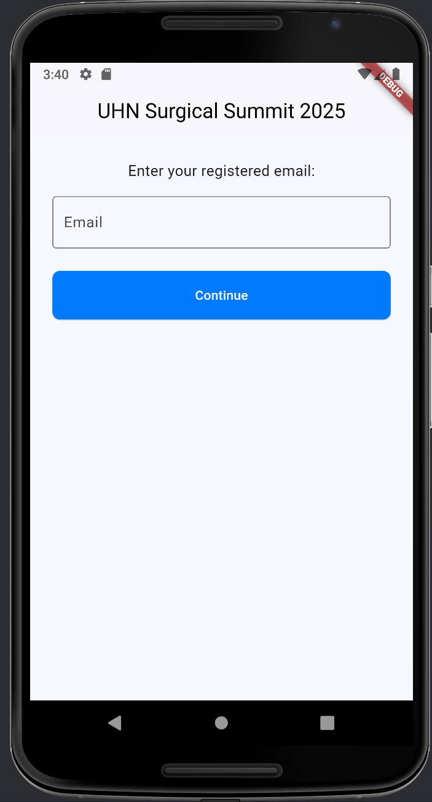
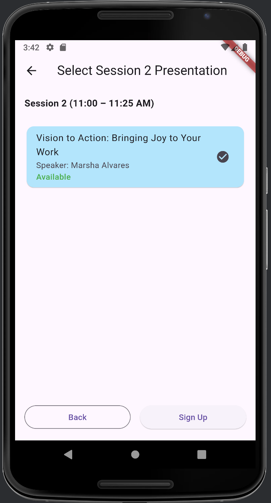
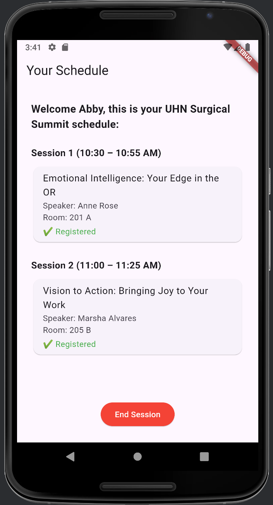

# UHN Surgical Summit 2025 – Demo

This Flutter application is a demo. 
It simulates a conference session signup and scheduling experience for UHN Summit 2025.

---

## 📱 Features

- ✅ Email-based attendee login (restricted to `@uhn.ca` emails)
- ✅ Session selection options personally designed for each nurse based on there UHN data
- ✅ Session selection with seat limits (max 10 per session)
- ✅ Firestore-based signup tracking
- ✅ Personalized schedule screen
- ✅ Clean UI

---

## 🏗️ Tech Stack

- **Flutter** (UI)
- **Firebase Firestore** (Data backend)
- **Firebase Hosting** (optional deployment)
- **Dart** (Language)

---

## 📂 Project Structure
lib/
├── models/ # Data models (User, Presentation)
├── controllers/ # Business logic and Firestore abstraction
├── services/ # Firestore integration
├── screens/ # UI Screens (EmailPrompt, Session1, Schedule)
├── routes/ # Named route management
└── main.dart # Entry point

---

## 🔥 Firebase Setup

You’ll need:
- A Firestore database with these collections:
    - `presentations` – base data with fields: `id`, `title`, `room`, `speaker`, `session`, `audience`
    - `presentation_signup` – session-tracked signup (IDs like `presentationId_s1`)
    - `attendees` – user email docs to track `signedUp: true/false`

---

## 🚀 Getting Started

1. Clone this repo
2. Run `flutter pub get`
3. Add your Firebase config (e.g., `google-services.json` or `firebase_options.dart`)

## 📸 Screenshots

### Email Prompt Screen

### Session Selection

### Schedule Screen
